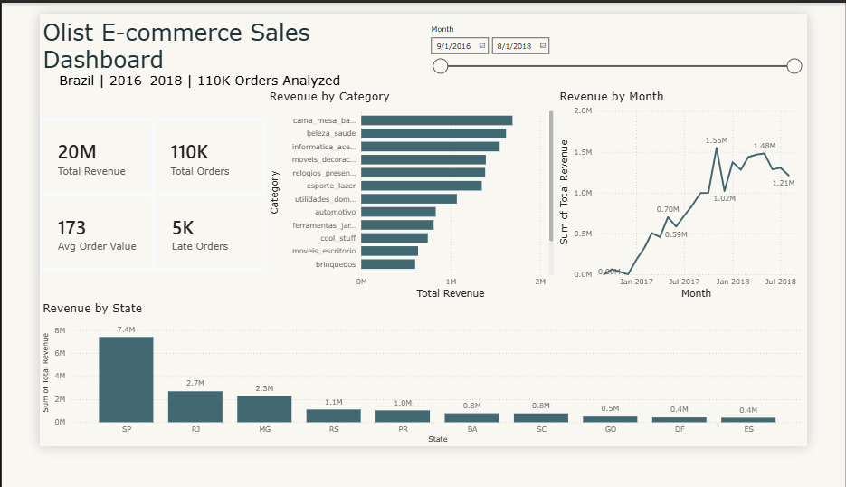

# Olist E-commerce Sales Dashboard

## Project Overview
Analysis of 110,000+ orders from Olist, Brazil's largest e-commerce platform (2016–2018).
Uncovered revenue trends, top-performing categories, regional performance, and delivery issues.

## 📊 Dashboard Preview

## Key Insights
- **Total Revenue:** $19.77M across 110K orders
- **Top Category:** Bed & Bath (cama_mesa_banho) — $1.69M revenue
- **Top State:** São Paulo (SP) — $7.4M (37% of total revenue)
- **Delivery Problem:** 4,558 orders delayed +30 days (4.1%) — requires logistics review

## Tools Used
- Python (Pandas) — Data cleaning & EDA
- Power BI — Interactive dashboard
- Excel — Data preparation

## 📁 Repository Structure & Quick Links

### 📊 Visualizations & Reports
*   🖼️ **Main Dashboard:** [dashboard_screenshot.png](./dashboard_screenshot.png)
*   📈 **Monthly Sales Trends:** [monthly_sales.png](./monthly_sales.png)
*   🏆 **Top Categories Analysis:** [top_categories.png](./top_categories.png)
*   🗺️ **Regional Performance:** [top_states.png](./top_states.png)
*   🚚 **Logistics & Delivery:** [delivery_distribution.png](./delivery_distribution.png)

### 💻 Code & Data Directories
*   📂 **[Scripts/](./Scripts/)** — Contains the Python data cleaning notebook (`olist_cleaning.ipynb`).
*   📂 **[Data/](./Data/)** — Contains the processed Excel dataset (`olist_dashboard_data.xlsx`).
*   📂 **[Dashboard/](./Dashboard/)** — Dashboard folder directory.
